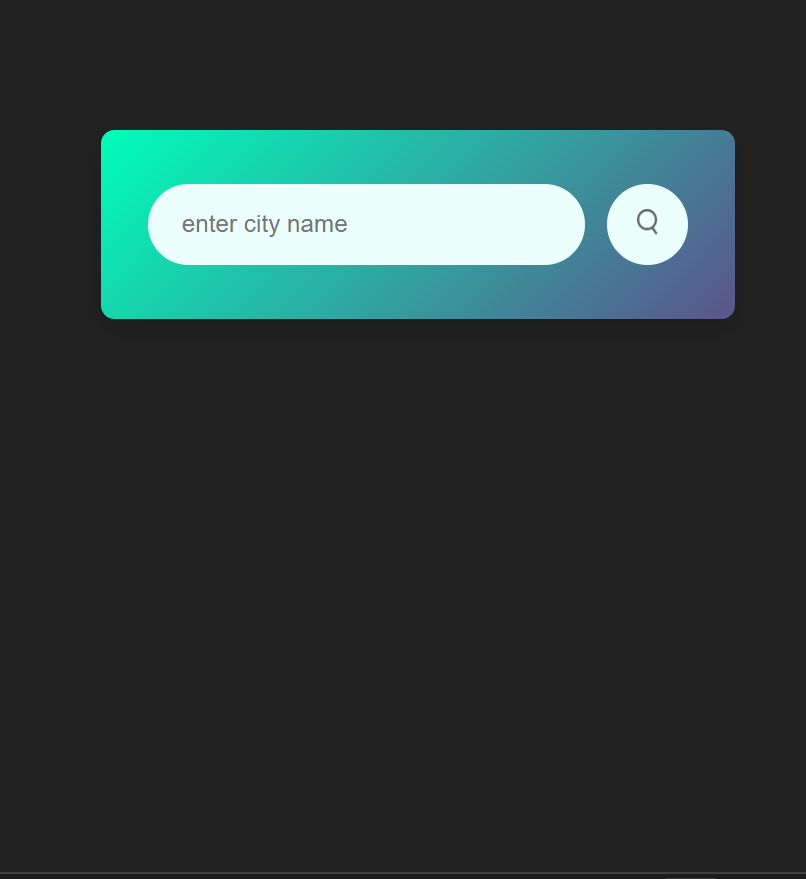
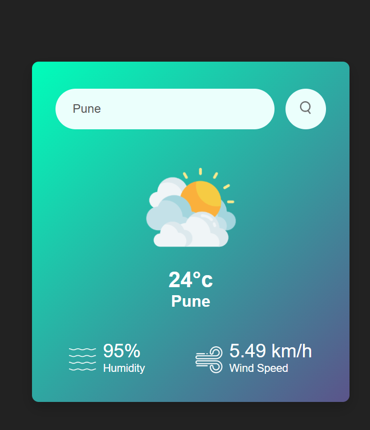

# 🌦️ Weather App

This is a simple weather app built using **HTML**, **CSS**, and **JavaScript**.  
It allows users to search for the current weather of any city using the **OpenWeatherMap API**.

---

## 🔗 Live Demo

👉 [Click here to see the live app](https://palak-dwivedi20.github.io/weather-app-js/) 

---

## 📸 Screenshots

### 🔹 Homepage View


### 🔹 After Searching City


---

## 💡 Features

- 🌍 Search weather by city name  
- 🌡️ Displays temperature, humidity, and wind speed  
- 🖼️ Dynamic icons based on weather condition  
- 📱 **Responsive design for mobile screens** using media queries

---

## 🛠️ Tech Stack

- HTML  
- CSS  
- JavaScript  
- OpenWeatherMap API  

---

## 📱 Responsive Design

This app is fully responsive.  
Media queries are used to optimize the layout for small screen devices (below 600px width).

```css
@media (max-width: 600px) {
  /* Responsive styles */
}

